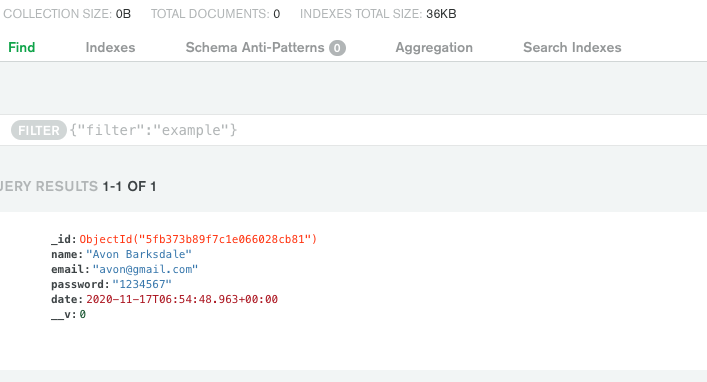

### Node Js ? Express ?
Node Js is an open-source, cross-platform runtime environment that allows developers to build all kinds of server-side applications and tools in JavaScript. 

Express.js is a framework for building web applications based on Node JS. Very light, it brings few overlays to maintain optimal performance and fast execution. 

### JWT ?

<div className="Image__Small">
  
</div>

 The principle is based on verifying that a user exists. If so, a token is provided. It is through the latter that the API server authorizes access to certain routes.
  A JWT is composed of 3 parts separated by a point:

* The header determines the type of token;
* The payload contains information about the user as his id ...;
* The signature contains a secret word that we passed.

[On the JWT.io site we can decode our token:](https://jwt.io/)


<div className="Image__Small">
  
</div>

#### Install Express for NodeJS
Lets initialize our project with these command

#### terminal
```
npm init -y
npm install express
npm install --save-dev nodemon
```
We modify our *package.json:* so that with each modification our server starts again by itself by doing *npm start* Nodemon index.js will be called at each modification of the file.

```js
"scripts": {
    "test": "echo \"Error: no test specified\" && exit 1",
    "start": "nodemon index.js"
  },
```
We create a folder *route* and inside create *auth.js* .
For the path */ register* in POST we just send a string *'Register Route'* and we export it to use it in *the index.js*.

#### routes/auth.js:
```js
const router = require('express').Router();

router.post('/register', (req, res) => {
    res.send('Register Route');
});

module.exports = router;

```
In our *index.js* we call mongoose in order to connect our database, the dotenv which we use to keep secret certain variables such as the login credentials to the database and the CORS in order to be able to make our HTTP requests.

#### index.js:
```js
const express = require('express');
const app = express();
const dotenv = require('dotenv');
const mongoose = require('mongoose');
const cors = require('cors');

//Import Routes
const authRouthe = require('./routes/auth');

dotenv.config();

//Connect Db
mongoose.connect(
    process.env.DB_CONNECT,
{
    useNewUrlParser: true,
    useUnifiedTopology: true,
    useCreateIndex: true,
    autoIndex: true,
  },
() => console.log('DB connected '));

// Middleware
app.use(express.urlencoded({ extended: true }));
app.use(express.json());
app.use(cors());

//Routes Middlewares
app.use('/api/user', authRoute);

app.listen(5000, () => console.log('Server is here'));

```


If we run *npm start* we will see in the terminal *'Server is here' 'DB connected'* and open postman with the same route like image bellow you should see in body *'Register Route'*

<div className="Image__Small">
  
</div>

Now we are going to model the way in which our Users will be saved in the database.

#### models/User.js:
```js
const mongoose = require('mongoose');

const userSchema = new mongoose.Schema({
    name: {
        type: String,
        required: true,
        min: 3,
        max: 100,
    },
    email: {
        type: String,
        required: true,
        max: 100,
        min: 6
    },
    password: {
        type: String,
        required: true,
        max: 1024,
        min: 6
    },
    date: {
        type: Date,
        default: Date.now
    }
});

module.exports = mongoose.model('User', userSchema);

```

After having modeled our Users we will create a validation system to control what the Customer will enter, with the *@hapi/JOI* library.

#### routes/validation.js:
```js
const Joi = require('@hapi/joi')


// Register validation
const registerValidation = (data) => {
    const schema= {
    name: Joi.string().min(3).required(),
    email: Joi.string().min(6).required().email(),
    password: Joi.string().min(6).required()
};

 return Joi.validate(data, schema);
}

// login validation
const loginValidation = (data) => {
    const schema= {
    email: Joi.string().min(6).required().email(),
    password: Joi.string().min(6).required()
};

 return Joi.validate(data, schema);
}


module.exports.registerValidation = registerValidation;
module.exports.loginValidation = loginValidation;
```

Now we can modify our *routes / auth.js* file to set up our registration system for the */ register* route by adding our validation functions.

```js
const router = require('express').Router();
const User = require('../models/User');
const {registerValidation} = require('../routes/validation');


router.post('/register', async (req,res) => {
     // Validate Data before we create user
    const {error} = registerValidation(req.body);
   
    if (error) return res.status(400).send(error.details[0].message);

    // Create New User 
   const user = new User({
      name: req.body.name,
      email: req.body.email,
      password: req.body.password 
    });
    try {
        const savedUser = await user.save();
        res.status(201).send(savedUser);
    } catch (err) {
        res.status(400).send(err);
    } 
});

module.exports = router;

```
Below we have a validation error because the type of the email field is not an email; the *@* is missing, for each error the corresponding message will be displayed.

<div className="Image__Small">
  
</div>

In the event that no validation error is detected, we register our User in the database. We can see that MongoDB automatically creates us an _id.

<div className="Image__Small">
  
</div>

Now that we have the possibility to register a User, we must make sure that the email entered by the Customer is not already registered in the database because later we will use the email for the connection.

#### routes/auth.js
```js
const router = require('express').Router();
const User = require('../models/User');
const {registerValidation} = require('../routes/validation');


router.post('/register', async (req,res) => {
     // Validate Data before we create user
    const {error} = registerValidation(req.body);
   
    if (error) return res.status(400).send(error.details[0].message);

    //Check if User is already in db
    const emailExist = await User.findOne({email: req.body.email});
    if(emailExist) return res.status(400).send('Email already exist');


   // Create New User 
   const user = new User({
      name: req.body.name,
      email: req.body.email,
      password: req.body.password 
    });
    try {
        const savedUser = await user.save();
        res.status(201).send(savedUser);
    } catch (err) {
        res.status(400).send(err);
    } 
});

module.exports = router;
```

Here is the message that will come out of the request if the email already exists :

<div className="Image__Small">
  
</div>

Once this step is completed, we will install *npm install bcrypt* to secure our passwords, bcrypt which is considered today as the most secure hash algorithm, bcrypt uses a *salt* a sequence that we added to the password and which is randomly generated. 

#### routes/auth.js
```js
const router = require('express').Router();
const User = require('../models/User');
const bcrypt = require('bcryptjs');
const {registerValidation} = require('../routes/validation');


router.post('/register', async (req,res) => {
     // Validate Data before we create user
    const {error} = registerValidation(req.body);
   
    if (error) return res.status(400).send(error.details[0].message);

    //Check if User is already in db
    const emailExist = await User.findOne({email: req.body.email});
    if(emailExist) return res.status(400).send('Email already exist');

    //Hash passwords
    const salt = await bcrypt.genSalt(10);
    const hashedPassword = await bcrypt.hash(req.body.password, salt);

   // Create New User 
   const user = new User({
      name: req.body.name,
      email: req.body.email,
      password: hashedPassword
    });
    try {
        const savedUser = await user.save();
        res.status(201).send({user: user._id});
    } catch (err) {
        res.status(400).send(err);
    } 
});

module.exports = router;
```

Once our User is registered we can see that with bcrypt our passwords are no longer hard but a long string of characters well secure.

<div className="Image__Small">
  
</div>

Now we have finished all that is the registration system of our User, we are now going to deal with the method of registering our Users in the database so that they can connect with their email and password.

#### routes/auth.js
```js
const router = require('express').Router();
const User = require('../models/User');
const bcrypt = require('bcryptjs');
const {registerValidation, loginValidation} = require('../routes/validation');


router.post('/register', async (req,res) => {
     // Validate Data before we create user
    const {error} = registerValidation(req.body);
   
    if (error) return res.status(400).send(error.details[0].message);

    //Check if User is already in db
    const emailExist = await User.findOne({email: req.body.email});
    if(emailExist) return res.status(400).send('Email already exist');

    //Hash passwords
    const salt = await bcrypt.genSalt(10);
    const hashedPassword = await bcrypt.hash(req.body.password, salt);

   // Create New User 
   const user = new User({
      name: req.body.name,
      email: req.body.email,
      password: hashedPassword
    });
    try {
        const savedUser = await user.save();
        res.status(201).send({user: user._id});
    } catch (err) {
        res.status(400).send(err);
    } 
});

//LOGIN
router.post('/login', async (req, res) => {
    // Validate Data before we create user
    const {error} = loginValidation(req.body);
    if (error) return res.status(400).send(error.details[0].message);

    //Check if email exist
    const user = await User.findOne({email: req.body.email});
    if(!user) return res.status(400).send('Email is wrong !');

    //Check Password is correct
    const validPassword = await bcrypt.compare(req.body.password, user.password);
    if (!validPassword) return res.status(400).send('Password is wrong !');


    res.send('LOGGED IN')


});

module.exports = router;
```

Above we start by doing our validation for example if the email is in the wrong format we will get an error message, once the validation is done we check if the entered email corresponds to a registered email, if the email is unknown a similar error message is displayed for the password.
If no error is detected the User can connect.

<div className="Image__Small">
  
</div>

Now we are going to manage JWT, we are going to assign to the connection of the User a token which will contain his Id and a secret phrase that we create.

#### routes/auth.js
```js
const router = require('express').Router();
const User = require('../models/User');
const bcrypt = require('bcryptjs');
const jwt = require('jsonwebtoken');
const {registerValidation, loginValidation} = require('../routes/validation');


router.post('/register', async (req,res) => {
     // Validate Data before we create user
    const {error} = registerValidation(req.body);
   
    if (error) return res.status(400).send(error.details[0].message);

    //Check if User is already in db
    const emailExist = await User.findOne({email: req.body.email});
    if(emailExist) return res.status(400).send('Email already exist');

    //Hash passwords
    const salt = await bcrypt.genSalt(10);
    const hashedPassword = await bcrypt.hash(req.body.password, salt);

   // Create New User 
   const user = new User({
      name: req.body.name,
      email: req.body.email,
      password: hashedPassword
    });
    try {
        const savedUser = await user.save();
        res.status(201).send({user: user._id});
    } catch (err) {
        res.status(400).send(err);
    } 
});

//LOGIN
router.post('/login', async (req, res) => {
    // Validate Data before we create user
    const {error} = loginValidation(req.body);
    if (error) return res.status(400).send(error.details[0].message);

    //Check if email exist
    const user = await User.findOne({email: req.body.email});
    if(!user) return res.status(400).send('Email is wrong !');

    //Check Password is correct
    const validPassword = await bcrypt.compare(req.body.password, user.password);
    if (!validPassword) return res.status(400).send('Password is wrong !');

    //Create and assign token
    const token = jwt.sign({_id: user._id}, process.env.TOKEN_SECRET);
    res.send(token)
});

module.exports = router;

```


With this token we can also create private routes where an unauthenticated user without a token will not be able to access them.
The code below will be used to check the token contained in the header if it corresponds to the user, if he does not have a token access will be refused.

#### routes/verifyToken.js
```js
const jwt = require('jsonwebtoken');

module.exports = function (req, res, next) {
    const token = req.header('auth-token');
    if (!token) return res.status(401).send('Access Denied !!!');

    try {
        const verified = jwt.verify(token, process.env.TOKEN_SECRET);
        req.user = verified;
    } catch (error) {
        res.status(400).send('Invalid Token');
    }
}
```

We create a simple route let's say it's a blog where we display a post and we only want to show it to authenticated users. We pass the verifyToken middleware to our route.


```js
const router = require('express').Router();
const verifyToken = require('./verifyToken');


router.get('/', verifyToken, (req, res) => {
    res.json({
        posts : {
            title: 'my favourite song', 
            description: '2pac'
        }
    })
})
module.exports = router;
```


Then we export our route so that we can use it in our *index.js*.

#### index.js
```js
const express = require('express');
const app = express();
const dotenv = require('dotenv');
const mongoose = require('mongoose');
const cors = require('cors');

//Import Route
const authRoute = require('./routes/auth');
const postRoute = require('./routes/post');

dotenv.config();

//Connect Db
mongoose.connect(
    process.env.DB_CONNECT,
{
    useNewUrlParser: true,
    useUnifiedTopology: true,
    useCreateIndex: true,
    autoIndex: true,
  },
() => console.log('DB connected '))

// Middleware
app.use(express.urlencoded({ extended: true }));
app.use(express.json());
app.use(cors());

// Route middlewware
app.use('/api/user', authRoute);
app.use('/api/posts', postRoute);


app.listen(5000, () => console.log('App is here'));
```
If we try to access the route whitout being authenticated the access will be refused
<div className="Image__Small">
  
</div>

First, our User will authenticate, the token will be created

<div className="Image__Small">
  
</div>

Then we will take this token to assign it to the * 'auth-token' * key in the header to allow the User to see the post.

<div className="Image__Small">
  
</div>

## Thanks for the attention 😁  and i was inspired from this video tutorial 👇 
### [Dev Ed 📹 🎥 ](https://www.youtube.com/watch?v=2jqok-WgelI&t=3496s)