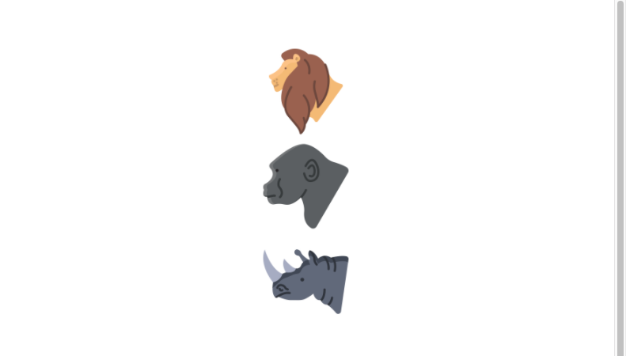
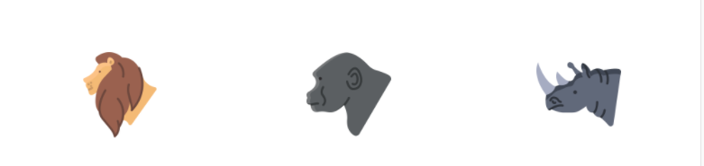
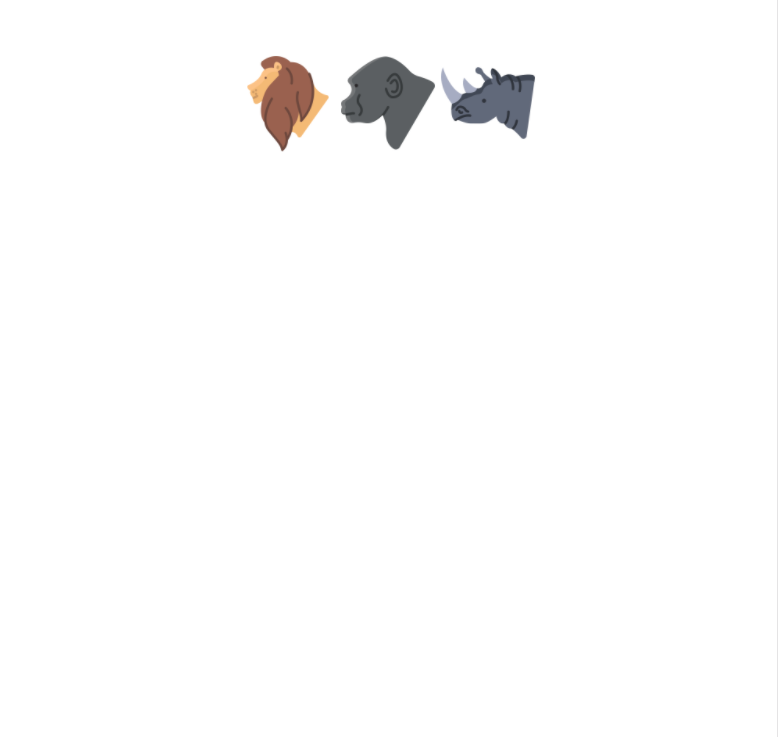
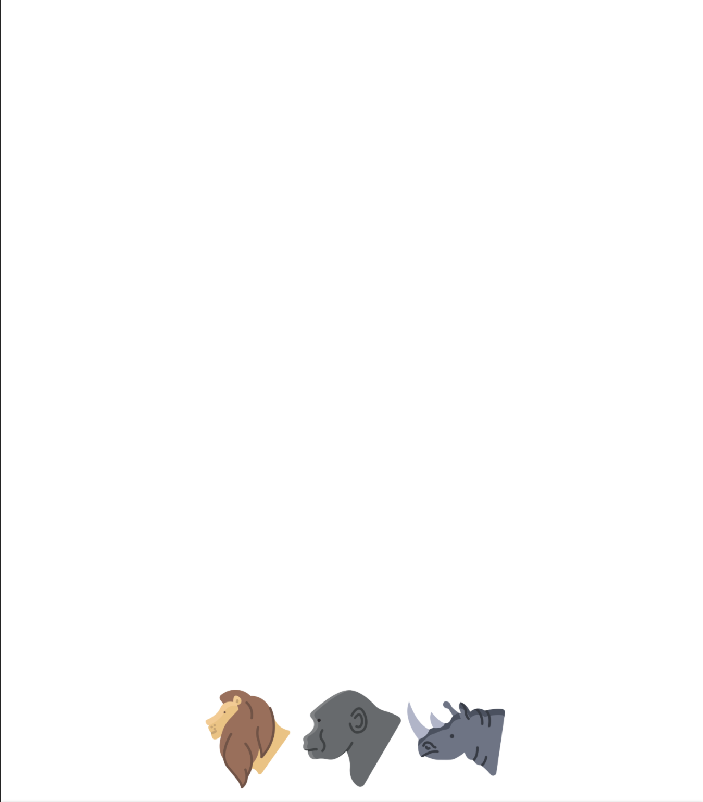
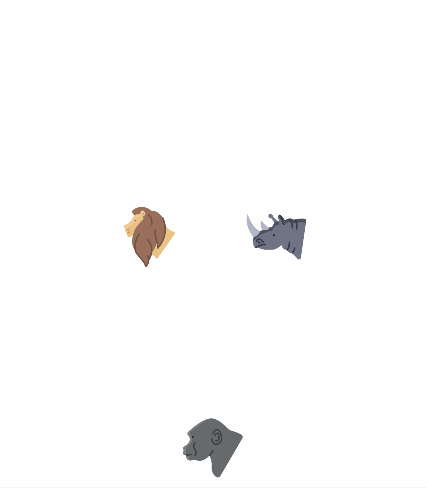
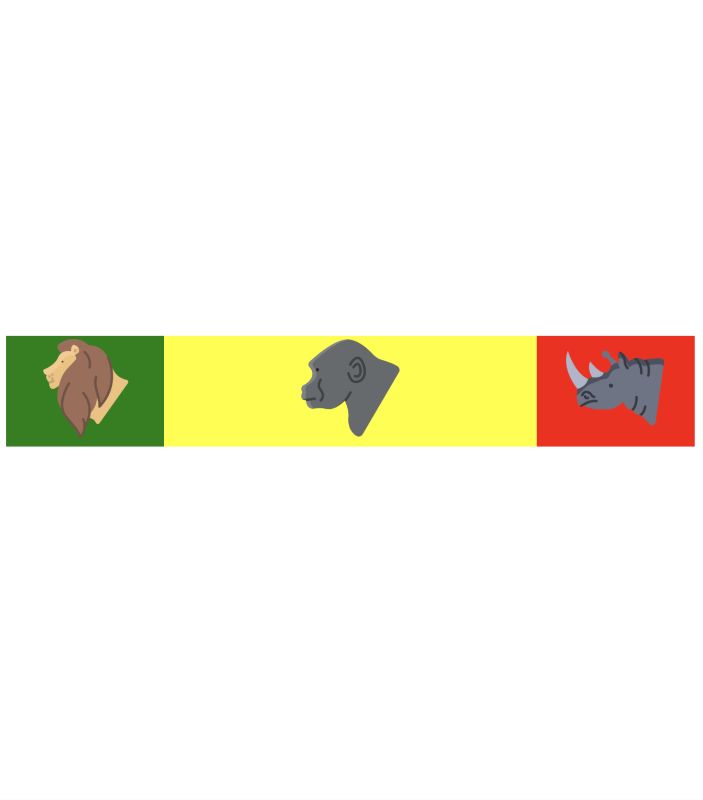

Flexbox is a great way to get more flexibility in your layouts and to simplify responsive layout design.

### Base

In Html files create this base code :

```javascript
<div class="container">
  <div class="child1">
    
  </div>
  <div class="child2">
    
  </div>
  <div class="child3">
    
  </div>
</div>
```

In CSS files create this style :

```javascript
.container {
  height: 100vh;
}
```

<div className="Image__Small">
  
   
</div>

### FLEX

In Html files create this base code :

```javascript
.container {
  height: 100vh;
}
```

### FLEX-DIRECTION

This property allows us to set the direction in which our items should be inside the flex-container.

## row

```javascript
.container {
  height: 100vh;
  display: flex;
  flex-direction: row;
}
```

<div className="Image__Small">
  
</div>

## row-reverse

```javascript
.container {
  height: 100vh;
  display: flex;
  flex-direction: row-reverse;
}
```

<div className="Image__Small">
  
</div>

## column

```javascript
.container {
  height: 100vh;
  display: flex;
  flex-direction: column;
}
```

<div className="Image__Small">
  
</div>

## column-reverse

```javascript
.container {
  height: 100vh;
  display: flex;
  flex-direction: column-reverse;
}
```

<div className="Image__Small">
  
</div>

### JUSTIFY-CONTENT

This property arranges items along the MAIN AXIS inside the container.

## flex-start

```javascript
.container {
  height: 100vh;
  display: flex;
  flex-direction: row;
  justify-content: flex-start
}
```

<div className="Image__Small">
  
</div>

## flex-end

```javascript
.container {
  height: 100vh;
  display: flex;
  flex-direction: row;
  justify-content: flex-end
}
```

<div className="Image__Small">
  
</div>

## center

```javascript
.container {
  height: 100vh;
  display: flex;
  flex-direction: row;
  justify-content: center
}
```

<div className="Image__Small">
  
</div>

## space-between

```javascript
.container {
  height: 100vh;
  display: flex;
  flex-direction: row;
  justify-content: space-between
}
```

<div className="Image__Small">
  
</div>

## space-around

```javascript
.container {
  height: 100vh;
  display: flex;
  flex-direction: row;
  justify-content: space-around
}
```

<div className="Image__Small">
  
</div>

### ALIGN-CONTENT

This property arranges items along the CROSS AXIS inside the container.

## flex-start

```javascript
.container {
  height: 100vh;
  display: flex;
  flex-direction: row;
  justify-content: center;
  align-content: flex-start;
  // without flex-wrap , align-content can't work
  flex-wrap: wrap;
}
```

<div className="Image__Small">
  
</div>

## center

```javascript
.container {
  height: 100vh;
  display: flex;
  flex-direction: row;
  justify-content: center;
  align-content: center;
  // without flex-wrap , align-content can't work
  flex-wrap: wrap;
}
```

<div className="Image__Small">
  
</div>

## flex-end

```javascript
.container {
  height: 100vh;
  display: flex;
  flex-direction: row;
  justify-content: center;
  align-content: flex-end;
  // without flex-wrap , align-content can't work
  flex-wrap: wrap;
}
```

<div className="Image__Small">
  
</div>

### ALIGN-SELF

This property works on the children classes. It positions the selected item along the Cross Axis. You have 6 value for this :

<ul>
<li>flex-start </li>
<li>flex-end </li>
<li>center </li>
<li>baseline </li>
<li>stretch </li>
<li>auto </li>
</ul>

```javascript
.container {
  height: 100vh;
  display: flex;
  flex-direction: row;
  justify-content: center;
 align-items : center;

  flex-wrap: wrap;
}

.child2{
     align-self : flex-end;
}
```

<div className="Image__Small">
  
</div>

### FLEX-GROW

Flex-grow : grows the size of a flex-item based on width of the flex-container.

```javascript
.container {
  height: 100vh;
  display: flex;
  flex-direction: row;
  justify-content: center;
 align-items : center;

  flex-wrap: wrap;
}
.child1{
    flex-grow: 1;
    background-color: green;
}
.child2{
    flex-grow: 5;
    background-color: yellow;
}
.child3{
    flex-grow: 1;
    background-color: red;
}
```

<div className="Image__Small">
  
</div>
