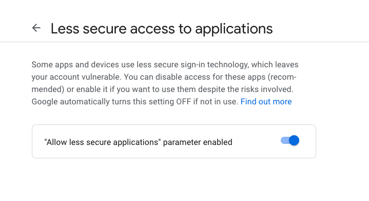
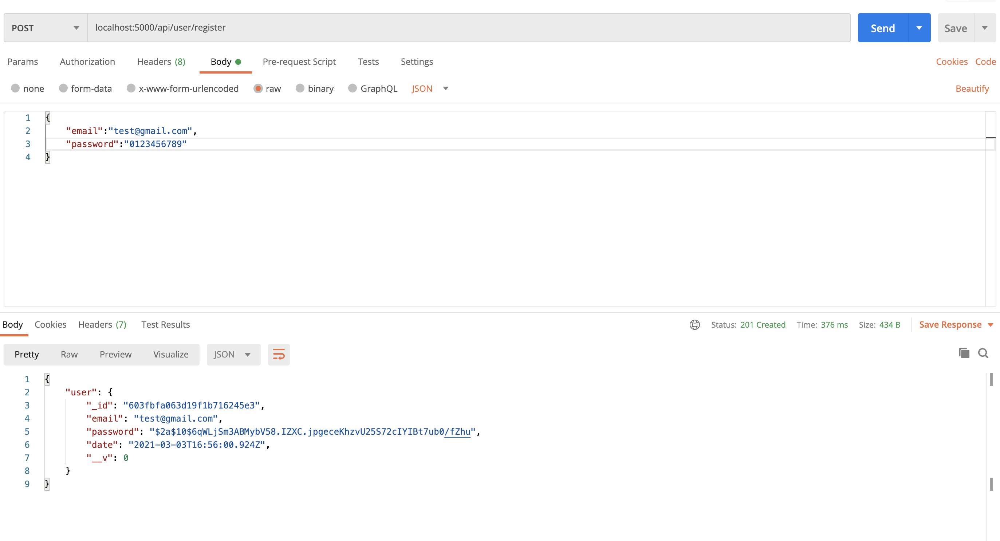
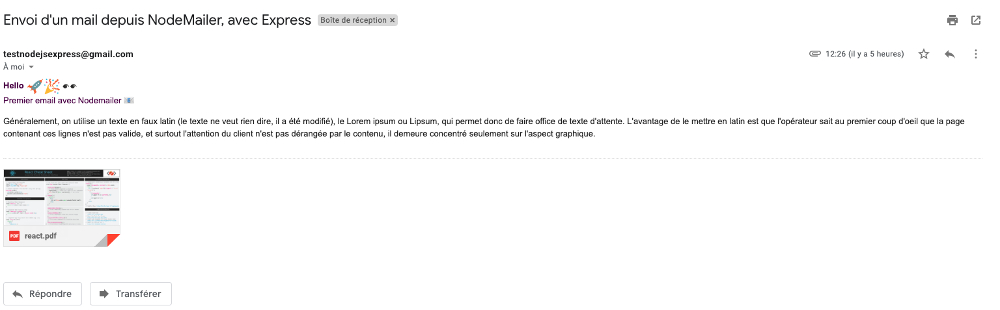

Nodemailer is a Node.js module that allows you to send emails from your server with ease. Notify the user that he is registered, that his password has been changed ...

### SETUP

We will start again from the code base of our previous API of the following article : [Express API](https://mahamat-salle-mansour-blog.netlify.app/Node.js-API-Authentication-With-JWT-Tutorial), you can follow this little tutorial to have the same structure.

### INSTALL NODEMAIL

We start by installing Nodemailer.

```javascript
npm install nodemailer
```

### USAGE

Here we are using Nodemailer for notify the user that his registration has been registered in database.
When the user press the button for create his profile, we send the email of confirmation on his email address.
In our files _auth.js_, we'll create this method.

Import Nodemailer in _auth.js_

```javascript
var nodemailer = require("nodemailer");
```

After that Nodemailer needs a transport configuration for send the email, in this example I use Gmail, always in _auth.js_ :

```javascript
const transporter = nodemailer.createTransport({
  port: 465, // true for 465, false for other ports
  host: "smtp.gmail.com",
  auth: {
    user: "youremailadress@gmail.com",
    pass: "password",
  },
  secure: true,
});
```

Important just after write this, you should go to your Gmail security settings for allow less secure application if not Google will block the email.

<div className="Image__Small">
  
</div>

Now we'll configure the sender, receivers, object and body content of our email.
Here I send to the email address the user enters and i attach a PDF document, i inform _filename_ it's the name that user will see on his email, and the _path_ it's where the file is store on your code

```javascript
const mailData = {
  from: "testnodejsexpress@gmail.com", // sender address
  to: req.body.email,
  subject: "Envoi d'un mail depuis NodeMailer, avec Express",
  html: "<b>Hello 🚀🎉👀 </b> <br> Premier email avec Nodemailer 📧 <br/>",
  attachments: [
    {
      filename: "react.pdf",
      path: "pdf/react.pdf",
    },
  ],
};
```

We are now going to call the function that allows us to send our email just after the method who create the users , this _ sendMail _ function takes two arguments as parameters, our _ mailData _ object and a callback function that will send us a message in the Node console if the sending was successful or fail

```javascript
transporter.sendMail(mailData, function(err, info) {
  if (err) console.log(err);
  else console.log(info);
});
```

The final code of _auth.js_ should look like that :

```javascript
const router = require("express").Router();
const User = require("../models/User");
const bcrypt = require("bcryptjs");
const jwt = require("jsonwebtoken");
const { registerValidation, loginValidation } = require("../routes/validation");
var nodemailer = require("nodemailer");

const transporter = nodemailer.createTransport({
  port: 465, // true for 465, false for other ports
  host: "smtp.gmail.com",
  auth: {
    user: "youremailadress@gmail.com",
    pass: "password",
  },
  secure: true,
});

const mailData = {
  from: "youremailadress@gmail.com", // sender address
  to: req.body.email,
  subject: "Envoi d'un mail depuis NodeMailer, avec Express",
  html: "<b>Hello 🚀🎉👀 </b> <br> Premier email avec Nodemailer 📧 <br/>",
  attachments: [
    {
      filename: "react.pdf",
      path: "pdf/react.pdf",
    },
  ],
};

router.post("/register", async (req, res) => {
  // Validate Data before we create user
  const { error } = registerValidation(req.body);

  if (error) return res.status(400).send(error.details[0].message);

  //Check if User is already in db
  const emailExist = await User.findOne({ email: req.body.email });
  if (emailExist) return res.status(400).send("L'email est déjà utilisé");

  //Hash passwords
  const salt = await bcrypt.genSalt(10);
  const hashedPassword = await bcrypt.hash(req.body.password, salt);

  // Create New User
  const user = new User({
    email: req.body.email,
    password: hashedPassword,
  });
  try {
    const savedUser = await user.save();
    res.status(201).send({ user });
    transporter.sendMail(mailData, function(err, info) {
      if (err) console.log(err);
      else console.log(info);
    });
  } catch (err) {
    res.status(400).send(err);
  }
});

//LOGIN
router.post("/login", async (req, res) => {
  // Validate Data before we create user
  const { error } = loginValidation(req.body);
  if (error) return res.status(400).send(error.details[0].message);

  //Check if email exist
  const user = await User.findOne({ email: req.body.email });
  if (!user) return res.status(400).send("Cet email n'existe pas !");

  //Check Password is correct
  const validPassword = await bcrypt.compare(req.body.password, user.password);
  if (!validPassword)
    return res.status(400).send("Le mot de passe est incorrect !");

  //Create and assign token
  const token = jwt.sign({ _id: user._id }, process.env.TOKEN_SECRET, {
    expiresIn: "24h",
  });
  res.header("auth-token", token).send({ user, token });
});

module.exports = router;
```

It is not an optimal structure you can work on it.

Now with [POSTMAN](https://www.postman.com/) we can test to create one user

<div className="Image__Small">
  
</div>

Postman gives us a code 201 created, let's go to our mailbox to see if we have received the email with attachments.

<div className="Image__Small">
  
</div>

TADAAAAAAA... 🚀 🎉  we have received the email 🙌, congratulations you sent your first email from Node Js, now you can go further with this