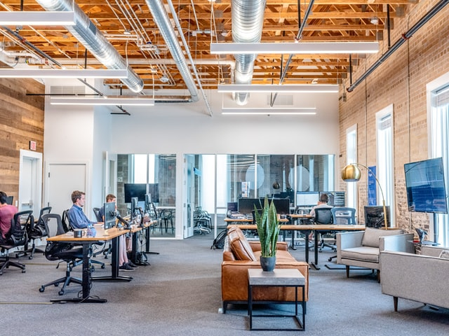

*Août 2019, c’est décidé je me reconvertis en tant que développeur web, 1 ans et demi après le début de ma reconversion j’aimerais faire le bilan de ce choix vers un nouveau métier.*
### D'où je viens ?

  

Revenons en 2011 (il y a 10 ans 😱 ), j'obtiens mon baccalauréat STG dans la foulée je m'inscris en licence économie-gestion, je n'ai aucun projet d'étude précis mais j'y vais quand même faire plaisir à Maman, je réussis à tenir 3 mois 😂 avant de décider d'arrêter les études 🙄 .

J'enchaine inactivité et petits boulots (préparateur de commande, manutentionnaire…)  jusqu'à obtenir un CDI dans le prêt-à-porter chez Zara en 2014 où je reste 2 ans avant de décider de quitter la région parisienne pour le soleil de Montpellier 😎 , où pareil je décroche un CDI en tant de que vendeur mais au bout de 2 ans, je sens que je tourne en rond, je ne m'épanouis pas, je décide de mettre fin à mon contrat afin de trouver ma voie dans un métier où je m'épanouirais, où je serais challengé.

### La reflexion ?

  

Je me souviens que plus petit j’aimais beaucoup l’informatique et je disais à ma mère vouloir devenir “ingénieur en informatique” bien entendu je n’ai jamais pris cette direction pour moi il fallait être un crack des maths, mais maintenant que je suis au chômage il est temps pour moi de chercher des pistes.

Été 2019 je suis donc en vacances à Bali 🏝 je croise tout ces digital nomades qui bossent de n'importe où avec leurs pc ça m'intrigue, en rentrant je tombe sur un reportage sur une formation développeur web au JT de 13 h 📺, intéressé je veux en savoir plus, je me documente et là... Je tombe sur OpenClassrooms un site où je peux apprendre à coder gratuitement.
Je me lance pendant 1 mois tous les jours de 9 h à 17 h 👨‍💻 j'expérimente HTML/CSS et j'accroche totalement.

Je décide donc de contacter Pôle emploi afin de faire une formation Développeur web en 9 mois à l'ADRAR (un centre de formation à Montpellier), ma demande est acceptée, je réussis les tests d'admssion et c'est parti je commence dans 3 mois 🎉🎊. Je profite donc de ces 3 mois pour continuer à apprendre l'HTML/CSS, JavaScript et l'algorithmie, et plus j'apprends plus je m'y épanouis.

Le fait de résoudre des problèmes, travailler avec la technologie, créer de belles interfaces, récupérer des données, et aussi avoir la possibilité aussi de travailler de n'importe où dans le monde m'attire vraiment dans ce métier.

### Ma formation 

  
  <figcaption>An elephant at sunset</figcaption>

Je commence ma formation afin d’obtenir un titre pro de niveau bac +2 en décembre 2019, vraiment excité c’est parti pour 9 mois de formation très intense (7 mois + 2 mois de stage). Assez rapidement au vu de l’intensité je prends l’habitude de faire énormément de veille, pratiquer après la journée de formation et surtout apprendre de nouvelles choses pour être Développeur Front-End (👋 Udemy). Au milieu de la formation COVID-19 s’invite, désormais on passe en remote pour la formation, une nouveauté pour moi ce format là mais c’est une révélation pour moi j’accroche assez rapidement (organisation de ma journée, possibilité de faire du sport à ma pause déjeuner, je suis même devenu un véritable chef Cuisinier 👨‍🍳 ).

La formation touche à sa fin je passe mon titre professionnel que j’obtiens, entre temps je décide de poursuivre pour 1 an une formation en alternance à la Wild Code School et décroche un poste en alternance de développeur Front-End chez Web^ID.

### Comment j'ai décroché mon alternance  

  

Décrocher un poste que ce soit un stage, CDI ou une alternance n'est pas une chose facile en tant que "Développeur Junior", avant de débuter ma première formation j'ai souvent entendu ce conseil "Il faut que tu puisses prouver au recruteur que tu sais pratiquer".

Durant ma première formation, j'ai décidé de me créer un portfolio que j'ai hébergé en ligne qui serait la vitrine pour exposer mes projets de formations et projets perso. De là sur mon temps libre je me suis mis a faire des projets perso qui me permettaient de pratiquer et évoluer sur une technologie.

Grâce à ce portfolio je trouve très rapidement mon stage déjà puis lors de ma recherche d'alternance qui part d'une candidature spontanée chez Web^ ID (avant ça j'ai essuyé énormément de refus c’est le jeu) j'ai eu un test technique à faire
mais j'ai également pu appuyer ma candidature en montrant des projets concrets que j'avais pu réaliser, le but pour moi n'était pas de montrer que je suis une personne qui fait que de coder mais plus dans l'optique de montrer à mon interlocuteur que je sais coder sur la technologie requise et que j'en connais les grandes lignes.

Un super entretien qui s'est conclu par une réponse positive pour mon plus grand bonheur (je n’étais pas loin de courir dans toute la ville torse nu 😂😂 ), un pas de plus dans le chemin de cette reconversion, aucun regret et toujours aussi motivé à apprendre encore et encore surtout avec la super équipe qui m'entoure.

